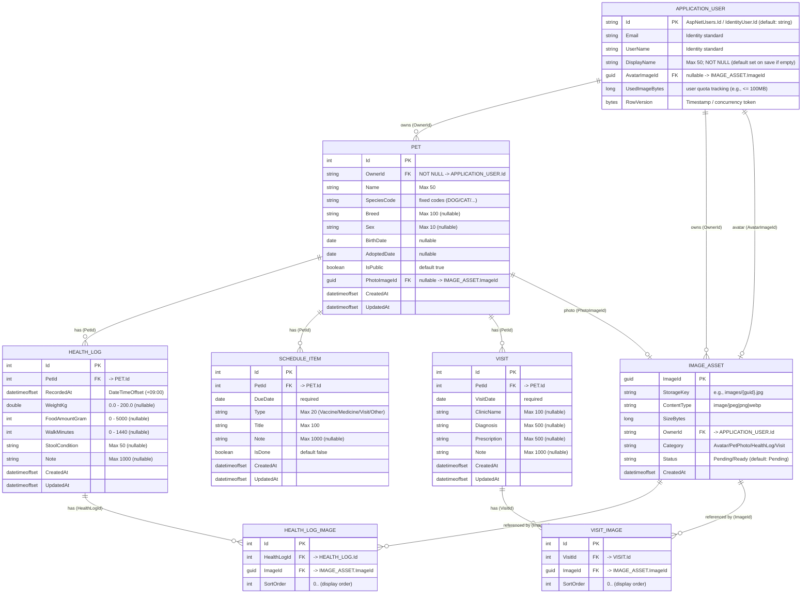

---

# ER図補足（インデックス／制約／FK／削除ルール）

## インデックス

- **PET**
  - `IX_PET_OwnerId`：`(OwnerId)`
  - `IX_PET_IsPublic_SpeciesCode`：`(IsPublic, SpeciesCode)`
  - `IX_PET_Name`：`(Name)`

- **HEALTH_LOG**
  - `IX_HEALTH_LOG_PetId_RecordedAt`：`(PetId, RecordedAt DESC)`

- **SCHEDULE_ITEM**
  - `IX_SCHEDULE_ITEM_PetId_DueDate`：`(PetId, DueDate ASC)`
  - （必要なら）`IX_SCHEDULE_ITEM_PetId_IsDone_DueDate`：`(PetId, IsDone, DueDate ASC)`

- **VISIT**
  - `IX_VISIT_PetId_VisitDate`：`(PetId, VisitDate DESC)`

- **IMAGE_ASSET**
  - `IX_IMAGE_ASSET_OwnerId_Status`：`(OwnerId, Status)`
  - `IX_IMAGE_ASSET_CreatedAt`：`(CreatedAt)`
  - `IX_IMAGE_ASSET_StorageKey`：`(StorageKey)`

- **HEALTH_LOG_IMAGE**
  - `IX_HEALTH_LOG_IMAGE_HealthLogId_SortOrder`：`(HealthLogId, SortOrder)`
  - `IX_HEALTH_LOG_IMAGE_ImageId`：`(ImageId)`

- **VISIT_IMAGE**
  - `IX_VISIT_IMAGE_VisitId_SortOrder`：`(VisitId, SortOrder)`
  - `IX_VISIT_IMAGE_ImageId`：`(ImageId)`

---

## 一意制約

- **HEALTH_LOG_IMAGE**
  - `UQ_HEALTH_LOG_IMAGE_HealthLogId_SortOrder`：`(HealthLogId, SortOrder)`  
    - 画像の「表示順」を安定させ、同一ログ内の重複順序を防ぐ

- **VISIT_IMAGE**
  - `UQ_VISIT_IMAGE_VisitId_SortOrder`：`(VisitId, SortOrder)`  
    - 同上（診療記録の添付画像）

- **IMAGE_ASSET**
  - `UQ_IMAGE_ASSET_StorageKey`：`(StorageKey)`  

---

## 外部キー制約（一覧）

- `PET.OwnerId -> APPLICATION_USER.Id`
- `HEALTH_LOG.PetId -> PET.Id`
- `SCHEDULE_ITEM.PetId -> PET.Id`
- `VISIT.PetId -> PET.Id`
- `HEALTH_LOG_IMAGE.HealthLogId -> HEALTH_LOG.Id`
- `HEALTH_LOG_IMAGE.ImageId -> IMAGE_ASSET.ImageId`
- `VISIT_IMAGE.VisitId -> VISIT.Id`
- `VISIT_IMAGE.ImageId -> IMAGE_ASSET.ImageId`
- `IMAGE_ASSET.OwnerId -> APPLICATION_USER.Id`
- `APPLICATION_USER.AvatarImageId -> IMAGE_ASSET.ImageId`（nullable）
- `PET.PhotoImageId -> IMAGE_ASSET.ImageId`（nullable）

---

## 削除ルール

- `PET` を削除する場合：関連する `HEALTH_LOG / SCHEDULE_ITEM / VISIT` を **アプリ側で先に削除**
- `HEALTH_LOG` 削除：`HEALTH_LOG_IMAGE` を **アプリ側で先に削除**
- `VISIT` 削除：`VISIT_IMAGE` を **アプリ側で先に削除**
