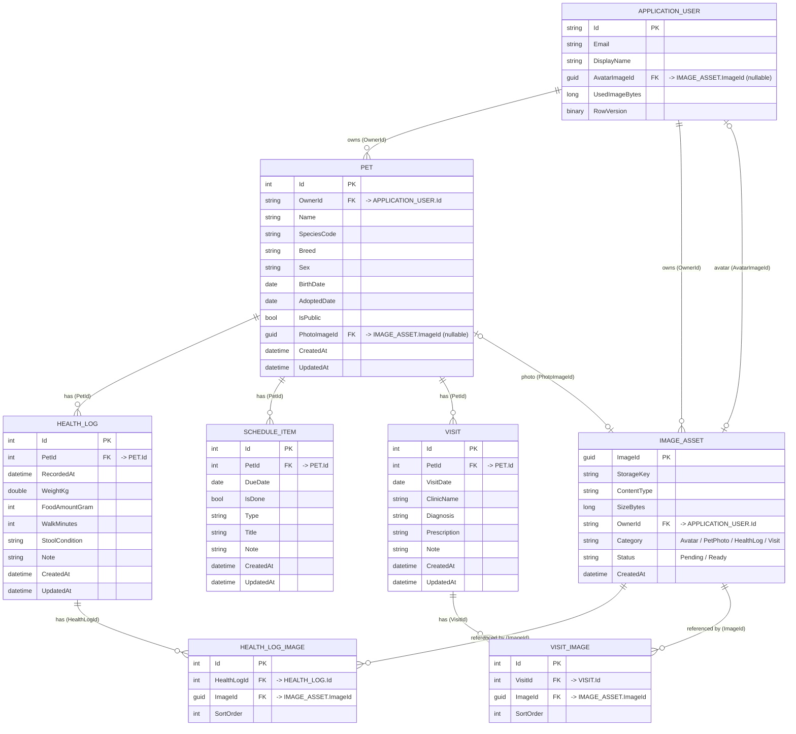

```mermaid

erDiagram
    %% -------------------------
    %% Relationships
    %% -------------------------
    APPLICATION_USER ||--o{ PET : "owns (OwnerId)"
    PET ||--o{ HEALTH_LOG : "has (PetId)"
    PET ||--o{ SCHEDULE_ITEM : "has (PetId)"
    PET ||--o{ VISIT : "has (PetId)"

    HEALTH_LOG ||--o{ HEALTH_LOG_IMAGE : "has (HealthLogId)"
    VISIT ||--o{ VISIT_IMAGE : "has (VisitId)"

    APPLICATION_USER ||--o{ IMAGE_ASSET : "owns (OwnerId)"
    IMAGE_ASSET ||--o{ HEALTH_LOG_IMAGE : "referenced by (ImageId)"
    IMAGE_ASSET ||--o{ VISIT_IMAGE : "referenced by (ImageId)"

    %% Optional single-image references (0..1 <-> 0..1)
    APPLICATION_USER o|--o| IMAGE_ASSET : "avatar (AvatarImageId)"
    PET             o|--o| IMAGE_ASSET : "photo (PhotoImageId)"

    %% -------------------------
    %% Entities
    %% -------------------------
    APPLICATION_USER {
        string Id PK
        string Email
        string DisplayName
        guid   AvatarImageId FK  "-> IMAGE_ASSET.ImageId (nullable)"
        long   UsedImageBytes
        binary RowVersion
    }

    PET {
        int      Id PK
        string   OwnerId FK       "-> APPLICATION_USER.Id"
        string   Name
        string   SpeciesCode
        string   Breed
        string   Sex
        date     BirthDate
        date     AdoptedDate
        bool     IsPublic
        guid     PhotoImageId FK  "-> IMAGE_ASSET.ImageId (nullable)"
        datetime CreatedAt
        datetime UpdatedAt
    }

    HEALTH_LOG {
        int      Id PK
        int      PetId FK          "-> PET.Id"
        datetime RecordedAt
        double   WeightKg
        int      FoodAmountGram
        int      WalkMinutes
        string   StoolCondition
        string   Note
        datetime CreatedAt
        datetime UpdatedAt
    }

    HEALTH_LOG_IMAGE {
        int   Id PK
        int   HealthLogId FK       "-> HEALTH_LOG.Id"
        guid  ImageId FK           "-> IMAGE_ASSET.ImageId"
        int   SortOrder
    }

    SCHEDULE_ITEM {
        int      Id PK
        int      PetId FK          "-> PET.Id"
        date     DueDate
        bool     IsDone
        string   Type
        string   Title
        string   Note
        datetime CreatedAt
        datetime UpdatedAt
    }

    VISIT {
        int      Id PK
        int      PetId FK          "-> PET.Id"
        date     VisitDate
        string   ClinicName
        string   Diagnosis
        string   Prescription
        string   Note
        datetime CreatedAt
        datetime UpdatedAt
    }

    VISIT_IMAGE {
        int   Id PK
        int   VisitId FK           "-> VISIT.Id"
        guid  ImageId FK           "-> IMAGE_ASSET.ImageId"
        int   SortOrder
    }

    IMAGE_ASSET {
        guid     ImageId PK
        string   StorageKey
        string   ContentType
        long     SizeBytes
        string   OwnerId FK        "-> APPLICATION_USER.Id"
        string   Category          "Avatar / PetPhoto / HealthLog / Visit"
        string   Status            "Pending / Ready"
        datetime CreatedAt
    }

```