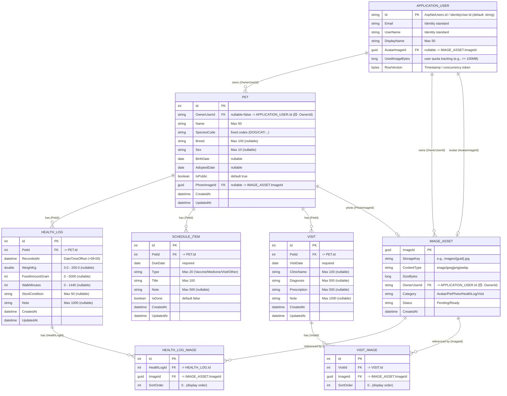

```mermaid

erDiagram
    %% -------------------------
    %% Relationships
    %% -------------------------
    APPLICATION_USER ||--o{ PET : "owns (OwnerUserId)"
    APPLICATION_USER ||--o{ IMAGE_ASSET : "owns (OwnerUserId)"

    PET ||--o{ HEALTH_LOG : "has (PetId)"
    PET ||--o{ SCHEDULE_ITEM : "has (PetId)"
    PET ||--o{ VISIT : "has (PetId)"

    HEALTH_LOG ||--o{ HEALTH_LOG_IMAGE : "has (HealthLogId)"
    VISIT ||--o{ VISIT_IMAGE : "has (VisitId)"

    IMAGE_ASSET ||--o{ HEALTH_LOG_IMAGE : "referenced by (ImageId)"
    IMAGE_ASSET ||--o{ VISIT_IMAGE : "referenced by (ImageId)"

    %% Optional single-image references
    APPLICATION_USER ||--o| IMAGE_ASSET : "avatar (AvatarImageId)"
    PET ||--o| IMAGE_ASSET : "photo (PhotoImageId)"

    %% -------------------------
    %% Entities
    %% -------------------------

    %% Identity user (physical table: AspNetUsers)
    APPLICATION_USER {
        string Id PK "AspNetUsers.Id / IdentityUser.Id (default: string)"
        string Email "Identity standard"
        string UserName "Identity standard"

        string DisplayName "Max 50"
        guid   AvatarImageId FK "nullable -> IMAGE_ASSET.ImageId"
        long   UsedImageBytes "user quota tracking (e.g., <= 100MB)"
        bytes  RowVersion "Timestamp / concurrency token"
    }

    PET {
        int      Id PK
        string   OwnerUserId FK "nullable=false -> APPLICATION_USER.Id (旧: OwnerId)"
        string   Name              "Max 50"
        string   SpeciesCode       "fixed codes (DOG/CAT/...)"
        string   Breed             "Max 100 (nullable)"
        string   Sex               "Max 10 (nullable)"
        date     BirthDate         "nullable"
        date     AdoptedDate       "nullable"
        boolean  IsPublic          "default true"

        guid     PhotoImageId FK   "nullable -> IMAGE_ASSET.ImageId"
        datetime CreatedAt
        datetime UpdatedAt
    }

    HEALTH_LOG {
        int      Id PK
        int      PetId FK           "-> PET.Id"
        datetime RecordedAt         "DateTimeOffset (+09:00)"
        double   WeightKg           "0.0 - 200.0 (nullable)"
        int      FoodAmountGram     "0 - 5000 (nullable)"
        int      WalkMinutes        "0 - 1440 (nullable)"
        string   StoolCondition     "Max 50 (nullable)"
        string   Note               "Max 1000 (nullable)"
        datetime CreatedAt
        datetime UpdatedAt
    }

    HEALTH_LOG_IMAGE {
        int    Id PK
        int    HealthLogId FK "-> HEALTH_LOG.Id"
        guid   ImageId FK     "-> IMAGE_ASSET.ImageId"
        int    SortOrder      "0.. (display order)"
    }

    SCHEDULE_ITEM {
        int      Id PK
        int      PetId FK       "-> PET.Id"
        date     DueDate        "required"
        string   Type           "Max 20 (Vaccine/Medicine/Visit/Other)"
        string   Title          "Max 100"
        string   Note           "Max 500 (nullable)"
        boolean  IsDone         "default false"
        datetime CreatedAt
        datetime UpdatedAt
    }

    VISIT {
        int      Id PK
        int      PetId FK         "-> PET.Id"
        date     VisitDate        "required"
        string   ClinicName       "Max 100 (nullable)"
        string   Diagnosis        "Max 500 (nullable)"
        string   Prescription     "Max 500 (nullable)"
        string   Note             "Max 1000 (nullable)"
        datetime CreatedAt
        datetime UpdatedAt
    }

    VISIT_IMAGE {
        int    Id PK
        int    VisitId FK  "-> VISIT.Id"
        guid   ImageId FK  "-> IMAGE_ASSET.ImageId"
        int    SortOrder   "0.. (display order)"
    }

    IMAGE_ASSET {
        guid     ImageId PK
        string   StorageKey       "e.g., images/{guid}.jpg"
        string   ContentType      "image/jpeg|png|webp"
        long     SizeBytes
        string   OwnerUserId FK   "-> APPLICATION_USER.Id (旧: OwnerId)"
        string   Category         "Avatar/PetPhoto/HealthLog/Visit"
        string   Status           "Pending/Ready"
        datetime CreatedAt
    }

```