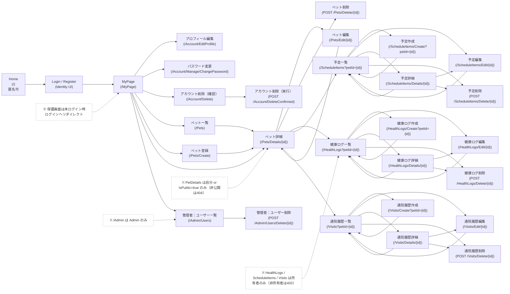

```mermaid
flowchart LR
  Home["Home<br/>(/)<br/>匿名可"] --> Login["Login / Register<br/>(Identity UI)"]

  Login --> MyPage["MyPage<br/>(/MyPage)"]

  MyPage --> EditProfile["プロフィール編集<br/>(/Account/EditProfile)"]
  MyPage --> ChangePassword["パスワード変更<br/>(/Account/Manage/ChangePassword)"]
  MyPage --> AccountDelete["アカウント削除（確認）<br/>(/Account/Delete)"]
  AccountDelete --> AccountDeleteConfirmed["アカウント削除（実行）<br/>(POST /Account/DeleteConfirmed)"]

  MyPage --> PetsIndex["ペット一覧<br/>(/Pets)"]
  MyPage --> PetCreate["ペット登録<br/>(/Pets/Create)"]
  MyPage --> PetDetails["ペット詳細<br/>(/Pets/Details/{id})"]

  PetsIndex --> PetDetails
  PetCreate --> PetDetails

  PetDetails --> PetEdit["ペット編集<br/>(/Pets/Edit/{id})"]
  PetDetails --> PetDelete["ペット削除<br/>(POST /Pets/Delete/{id})"]
  PetEdit --> PetDetails

  PetDetails --> HealthLogsIndex["健康ログ一覧<br/>(/HealthLogs?petId={id})"]
  HealthLogsIndex --> HealthLogCreate["健康ログ作成<br/>(/HealthLogs/Create?petId={id})"]
  HealthLogsIndex --> HealthLogEdit["健康ログ編集<br/>(/HealthLogs/Edit/{id})"]
  HealthLogsIndex --> HealthLogDetails["健康ログ詳細<br/>(/HealthLogs/Details/{id})"]
  HealthLogsIndex --> HealthLogDelete["健康ログ削除<br/>(POST /HealthLogs/Delete/{id})"]
  HealthLogDetails --> HealthLogsIndex
  HealthLogDetails --> HealthLogEdit
  HealthLogDetails --> HealthLogDelete
  HealthLogCreate --> HealthLogsIndex
  HealthLogEdit --> HealthLogsIndex

  PetDetails --> ScheduleIndex["予定一覧<br/>(/ScheduleItems?petId={id})"]
  ScheduleIndex --> ScheduleCreate["予定作成<br/>(/ScheduleItems/Create?petId={id})"]
  ScheduleIndex --> ScheduleEdit["予定編集<br/>(/ScheduleItems/Edit/{id})"]
  ScheduleIndex --> ScheduleDetails["予定詳細<br/>(/ScheduleItems/Details/{id})"]
  ScheduleIndex --> ScheduleDelete["予定削除<br/>(POST /ScheduleItems/Delete/{id})"]
  ScheduleDetails --> ScheduleIndex
  ScheduleDetails --> ScheduleEdit
  ScheduleDetails --> ScheduleDelete
  ScheduleCreate --> ScheduleIndex
  ScheduleEdit --> ScheduleIndex

  PetDetails --> VisitsIndex["通院履歴一覧<br/>(/Visits?petId={id})"]
  VisitsIndex --> VisitCreate["通院履歴作成<br/>(/Visits/Create?petId={id})"]
  VisitsIndex --> VisitEdit["通院履歴編集<br/>(/Visits/Edit/{id})"]
  VisitsIndex --> VisitDetails["通院履歴詳細<br/>(/Visits/Details/{id})"]
  VisitsIndex --> VisitDelete["通院履歴削除<br/>(POST /Visits/Delete/{id})"]
  VisitDetails --> VisitsIndex
  VisitDetails --> VisitEdit
  VisitDetails --> VisitDelete
  VisitCreate --> VisitsIndex
  VisitEdit --> VisitsIndex

  MyPage --> AdminUsers["管理者：ユーザー一覧<br/>(/Admin/Users)"]
  AdminUsers --> AdminUserDelete["管理者：ユーザー削除<br/>(POST /Admin/Users/Delete/{id})"]

  NoteAuth["※ 保護画面は未ログイン時ログインへリダイレクト"]:::note
  NoteOwner["※ HealthLogs / ScheduleItems / Visits は所有者のみ（非所有者は403）"]:::note
  NotePublic["※ PetDetails は自分 or IsPublic=true のみ（非公開は404）"]:::note
  NoteAdmin["※ /Admin は Admin のみ"]:::note

  NoteAuth -.-> MyPage
  NoteOwner -.-> HealthLogsIndex
  NotePublic -.-> PetDetails
  NoteAdmin -.-> AdminUsers

  classDef note fill:#fff,stroke:#999,stroke-dasharray: 4 4,color:#333;
```