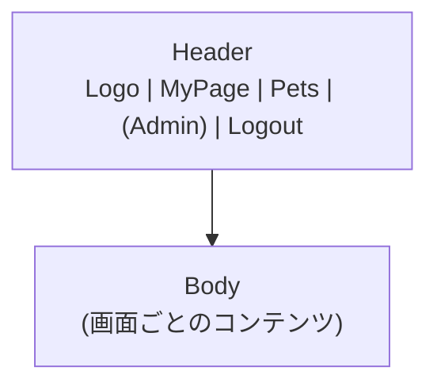
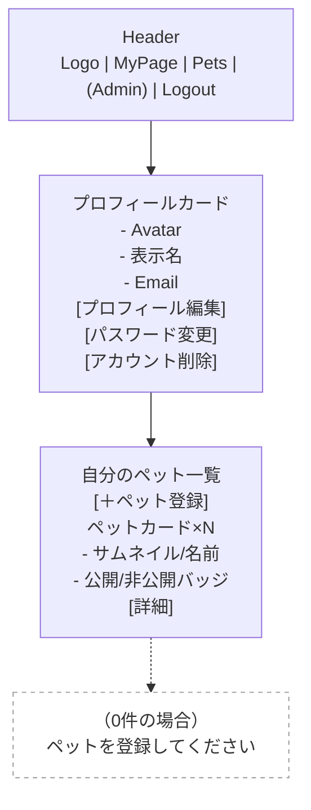
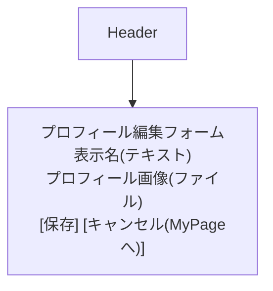
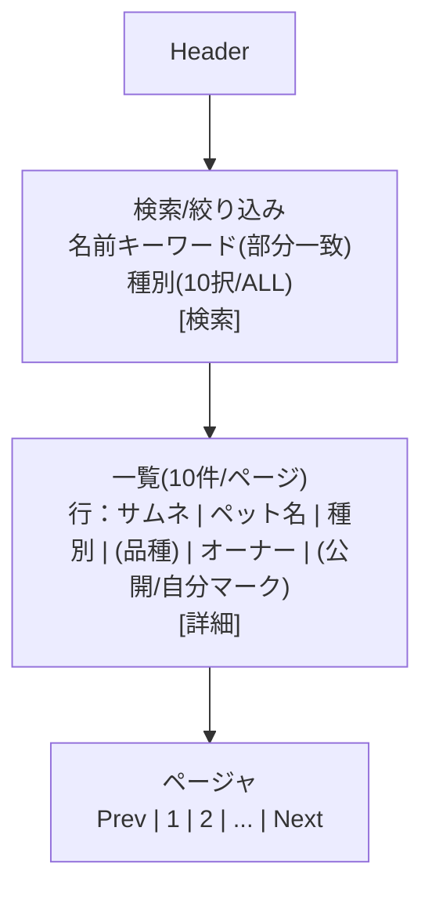
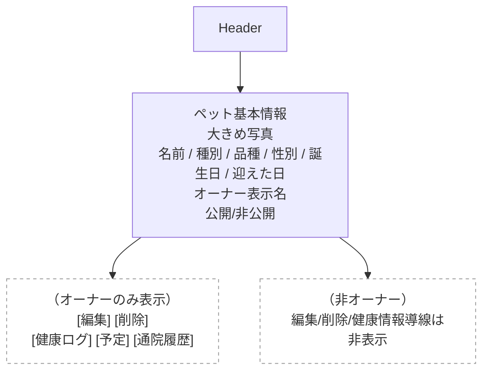
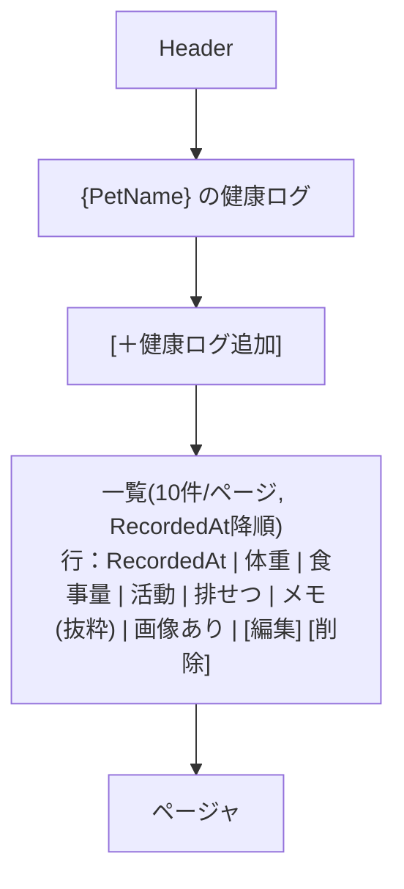
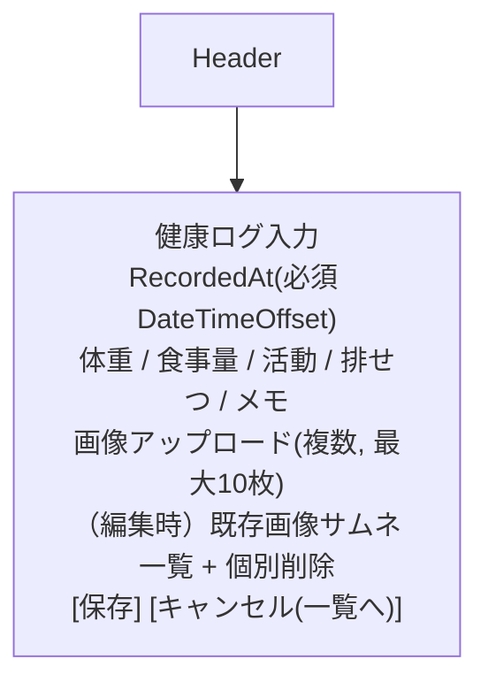
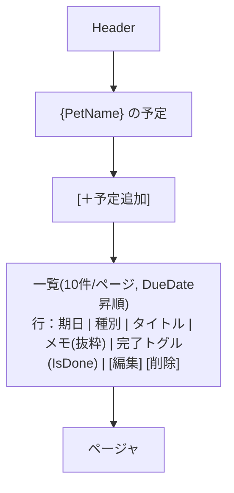
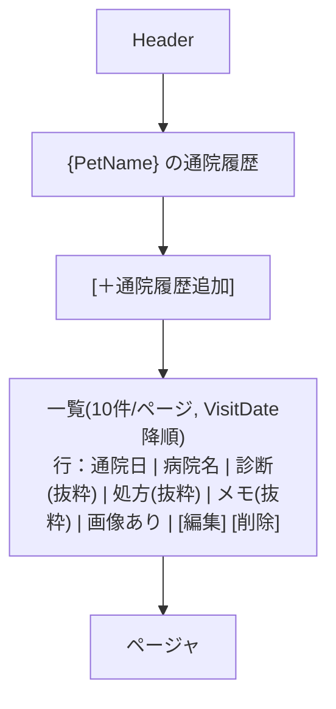
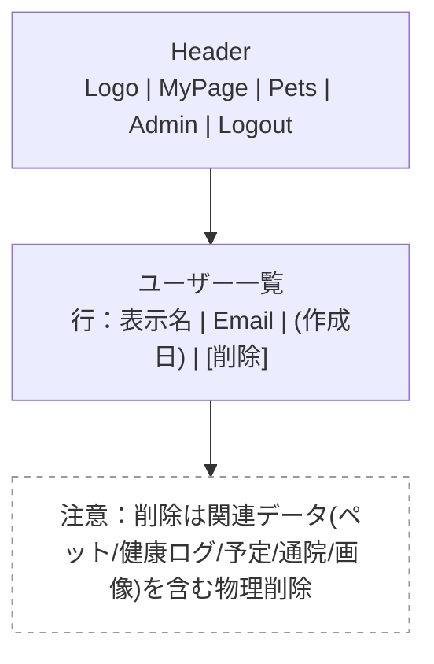

### 1) 共通レイアウト（ヘッダ＋ナビ）

---

### 2) MyPage（/MyPage）

（MyPageに表示する項目＋リンク要件）

---

### 3) プロフィール編集（/Account/EditProfile）

（表示名＋プロフィール画像の編集）

---

### 4) ペット一覧（/Pets）

（一覧表示項目・ページング・検索条件）

---

### 5) ペット詳細（/Pets/Details/{id}）

（詳細表示項目、オーナー導線、非公開ペットは404秘匿）

---

### 6) 健康ログ：一覧（/HealthLogs?petId=）

（健康ログ一覧の表示項目・ソート・画像あり表示）

---

### 7) 健康ログ：作成/編集（/HealthLogs/Create, /HealthLogs/Edit）

（登録・編集・画像最大10枚、既存画像の個別削除）

---

### 8) 予定：一覧（/ScheduleItems?petId=）

（予定一覧・ソート・完了フラグ切替）

---

### 9) 通院履歴：一覧（/Visits?petId=）

（通院履歴一覧・ソート・画像あり表示）

---

### 10) 管理者：ユーザー一覧（/Admin/Users）

（Admin機能のURL・削除、Adminでも閲覧特権なし）

---