# うちの子健康カルテ UIワイヤー
## 1) 共通レイアウト（モバイルファースト＋ナビ＋共通仕様）

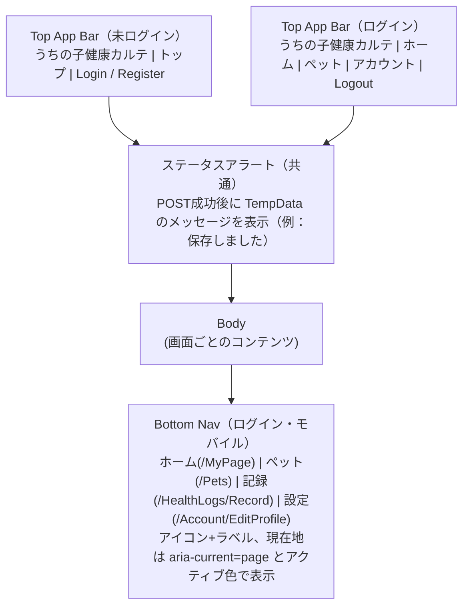
```mermaid
flowchart TB
  HeaderAnon["Top App Bar（未ログイン）<br/>うちの子健康カルテ | トップ | Login / Register"]
  HeaderAuth["Top App Bar（ログイン）<br/>うちの子健康カルテ | ホーム | ペット | アカウント | Logout"]
  StatusAlert["ステータスアラート（共通）<br/>POST成功後に TempData のメッセージを表示（例：保存しました）"]
  BottomNav["Bottom Nav（ログイン・モバイル）<br/>ホーム(/MyPage) | ペット(/Pets) | 記録(/HealthLogs/Record) | 設定(/Account/EditProfile)<br/>アイコン+ラベル、現在地は aria-current=page とアクティブ色で表示"]
  Body["Body<br/>(画面ごとのコンテンツ)"]

  HeaderAnon --> StatusAlert
  HeaderAuth --> StatusAlert
  StatusAlert --> Body
  Body --> BottomNav
```

- スマホ幅を主対象にしたモバイルファーストUIとし、PC幅では読みやすい最大幅を持つレスポンシブ表示にする
- ボトムナビは **768px 未満のモバイル幅のみ**表示し、768px 以上は上部ナビに一本化する（Bootstrap `navbar-expand-md` と揃える）
- ボトムナビの各項目はアイコン+ラベルで **タップ領域を44px以上**確保し、現在のセクションを `aria-current="page"` とアクティブ色で示す
- 第1段階では既存画面の見た目と操作性を改善し、新規の健康分析/月間カレンダー/通知設定/バックアップ等は追加しない（体重推移の簡易グラフは健康ログ一覧に含む）
- 下部ナビを使う場合、未実装機能へのリンクやダミー画面は置かず、既存URLへの導線だけを出す
- 一覧は原則 **10件/ページ**、ページ番号はクエリ `page`（1始まり）
- ページャは全ページ番号の列挙ではなく **「前へ / 現在ページ・総ページ / 次へ」** 形式とする
- POST成功後は共通レイアウトの **ステータスアラート**（TempData `StatusMessage`）で結果をフィードバックする
- 削除ボタンは必ず **確認ダイアログ**を挟む
- 一覧カードでは **値が空の項目は行ごと非表示**にする（「-」は表示しない）
- 画像表示は原則 **`GET /images/{imageId}`（認可付き）**。未設定時はデフォルト画像。一覧のサムネイルは `loading="lazy"` を付ける
- 画像アップロード（代表例）：`jpg/jpeg/png/webp`、**1ファイル最大2MB**、ユーザー合計 **100MB**、健康ログ/通院は **最大10枚（既存+追加合算）**
- 未ログインで保護URLにアクセス：ログインへリダイレクト（`returnUrl` で元ページへ復帰）
- **存在秘匿（404）**：非公開ペット（他ユーザー）／健康ログ・予定・通院（非オーナー）
- POST後の遷移：`returnUrl`（ローカルURLのみ許可）を優先、無効なら安全な既定（例：一覧）へ
- **PWA対応**：`manifest.webmanifest`（`standalone`、テーマ色 `#2f9e9b`）とアイコン（192/512/maskable/apple-touch-icon）を配信し、ホーム画面追加に対応する

---

## 2) Home（/）※匿名可

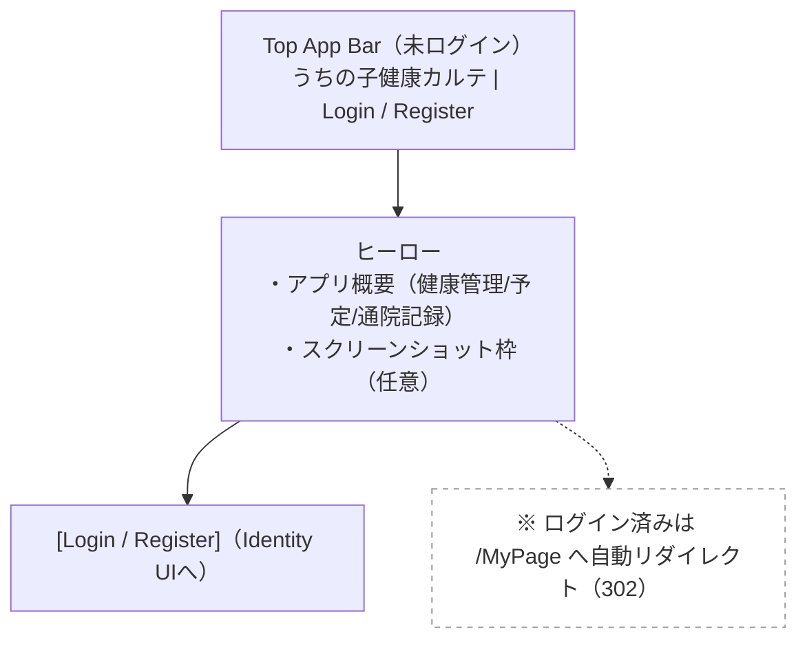
```mermaid
flowchart TB
  Header["Top App Bar（未ログイン）<br/>うちの子健康カルテ | Login / Register"]
  Hero["ヒーロー<br/>・アプリ概要（健康管理/予定/通院記録）<br/>・スクリーンショット枠（任意）"]
  CTA["[Login / Register]（Identity UIへ）"]
  Note["※ ログイン済みは /MyPage へ自動リダイレクト（302）"]:::note

  Header --> Hero --> CTA
  Hero -.-> Note

  classDef note fill:#fff,stroke:#999,stroke-dasharray: 4 4,color:#333;
```

---

## 3) Login / Register（Identity UI）

- URL：Identity 標準
- 主要要素：Email / Password / Register / Login
- 成功後：`returnUrl` があれば戻る、なければ `/MyPage`

---

## 4) 共通エラーページ（/Error/{statusCode}）

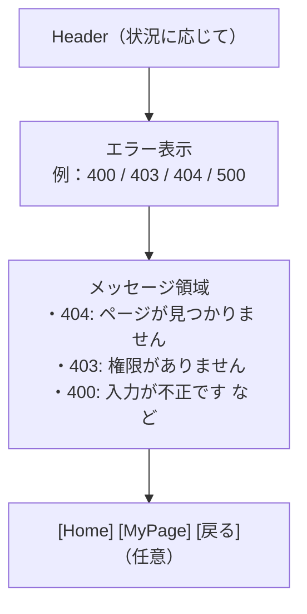
```mermaid
flowchart TB
  Header["Header（状況に応じて）"]
  Title["エラー表示<br/>例：400 / 403 / 404 / 500"]
  Message["メッセージ領域<br/>・404: ページが見つかりません<br/>・403: 権限がありません<br/>・400: 入力が不正です など"]
  Actions["[Home] [MyPage] [戻る]（任意）"]

  Header --> Title --> Message --> Actions
```

---

## 5) MyPage（/MyPage、ホーム/設定相当）

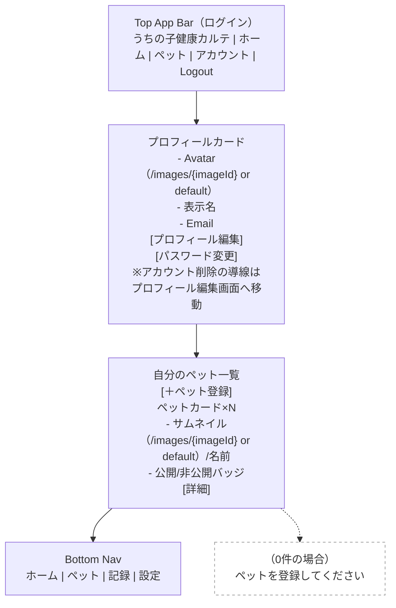
```mermaid
flowchart TB
  Header["Top App Bar（ログイン）<br/>うちの子健康カルテ | ホーム | ペット | アカウント | Logout"]
  BottomNav["Bottom Nav<br/>ホーム | ペット | 記録 | 設定"]
  Profile["プロフィールカード<br/>- Avatar（/images/{imageId} or default）<br/>- 表示名<br/>- Email<br/>[プロフィール編集]<br/>[パスワード変更]<br/>※アカウント削除の導線はプロフィール編集画面へ移動"]
  Pets["自分のペット一覧<br/>[＋ペット登録]<br/>ペットカード×N<br/>- サムネイル（/images/{imageId} or default）/名前<br/>- 公開/非公開バッジ<br/>[詳細]"]
  Empty["（0件の場合）<br/>ペットを登録してください"]:::note

  Header --> Profile --> Pets
  Pets --> BottomNav
  Pets -.-> Empty

  classDef note fill:#fff,stroke:#999,stroke-dasharray: 4 4,color:#333;
```

---

## 6) プロフィール編集（/Account/EditProfile）

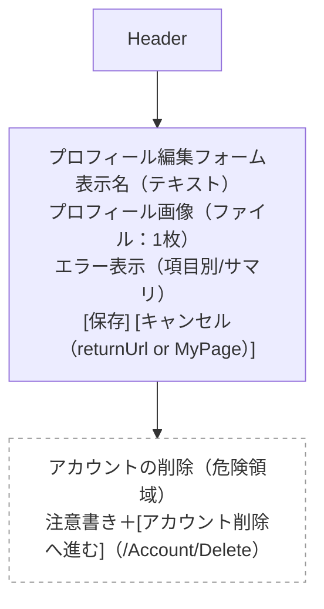
```mermaid
flowchart TB
  Header["Header"]
  Form["プロフィール編集フォーム<br/>表示名（テキスト）<br/>プロフィール画像（ファイル：1枚）<br/>エラー表示（項目別/サマリ）<br/>[保存] [キャンセル（returnUrl or MyPage）]"]
  Danger["アカウントの削除（危険領域）<br/>注意書き＋[アカウント削除へ進む]（/Account/Delete）"]:::note

  Header --> Form --> Danger

  classDef note fill:#fff,stroke:#999,stroke-dasharray: 4 4,color:#333;
```

---

## 7) パスワード変更（/Identity/Account/Manage/ChangePassword）※Identity 標準

- Current Password / New Password / Confirm New Password
- 成功時：`returnUrl` があれば戻る、なければ `/MyPage`

---

## 8) アカウント削除（確認）（/Account/Delete）

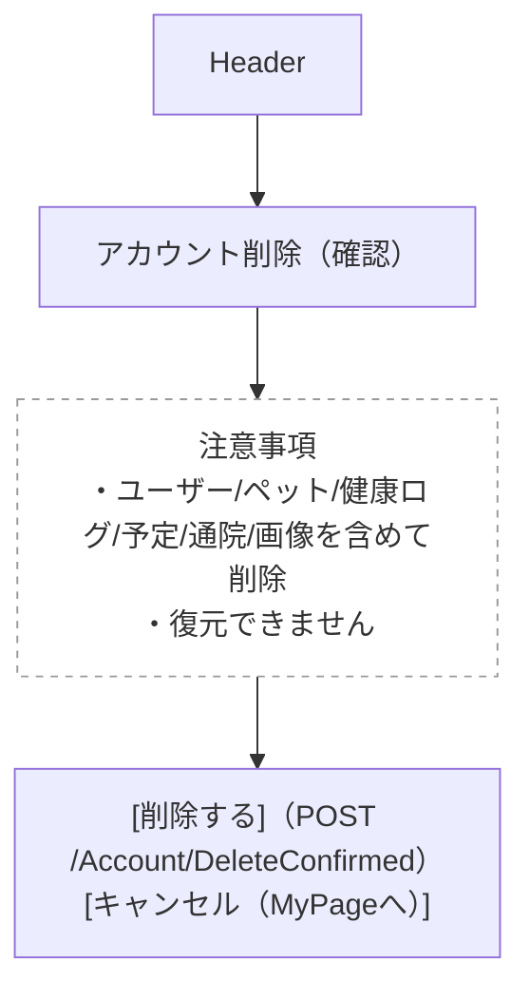
```mermaid
flowchart TB
  Header["Header"]
  Title["アカウント削除（確認）"]
  Warn["注意事項<br/>・ユーザー/ペット/健康ログ/予定/通院/画像を含めて削除<br/>・復元できません"]:::note
  Actions["[削除する]（POST /Account/DeleteConfirmed）<br/>[キャンセル（MyPageへ）]"]

  Header --> Title --> Warn --> Actions

  classDef note fill:#fff,stroke:#999,stroke-dasharray: 4 4,color:#333;
```

---

## 9) ペット一覧（/Pets?page={page}）

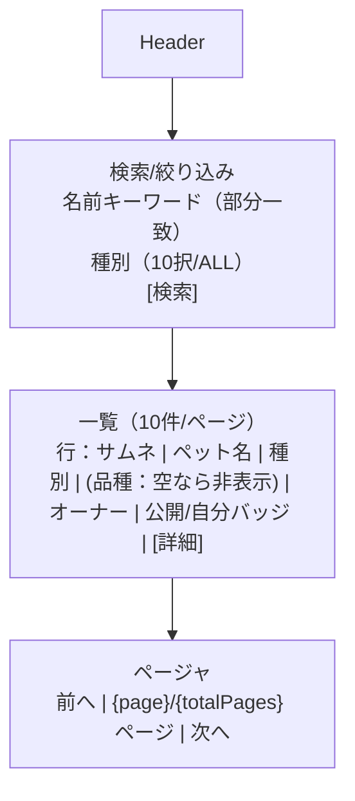
```mermaid
flowchart TB
  Header["Header"]
  Filters["検索/絞り込み<br/>名前キーワード（部分一致）<br/>種別（10択/ALL）<br/>[検索]"]
  List["一覧（10件/ページ）<br/>行：サムネ | ペット名 | 種別 | (品種：空なら非表示) | オーナー | 公開/自分バッジ | [詳細]"]
  Pager["ページャ<br/>前へ | {page}/{totalPages} ページ | 次へ"]

  Header --> Filters --> List --> Pager
```

- 表示対象：自分のペット（公開/非公開問わず）＋他ユーザーの公開ペット

---

## 10) ペット登録（/Pets/Create）

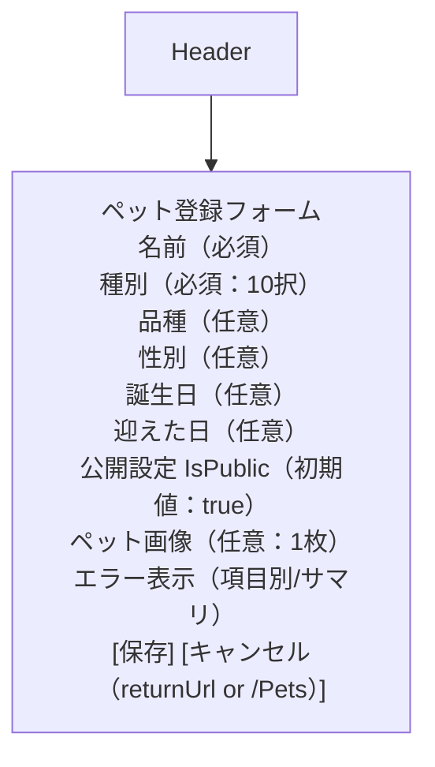
```mermaid
flowchart TB
  Header["Header"]
  Form["ペット登録フォーム<br/>名前（必須）<br/>種別（必須：10択）<br/>品種（任意）<br/>性別（任意）<br/>誕生日（任意）<br/>迎えた日（任意）<br/>公開設定 IsPublic（初期値：true）<br/>ペット画像（任意：1枚）<br/>エラー表示（項目別/サマリ）<br/>[保存] [キャンセル（returnUrl or /Pets）]"]

  Header --> Form
```

---

## 11) ペット詳細（/Pets/Details/{petId}）

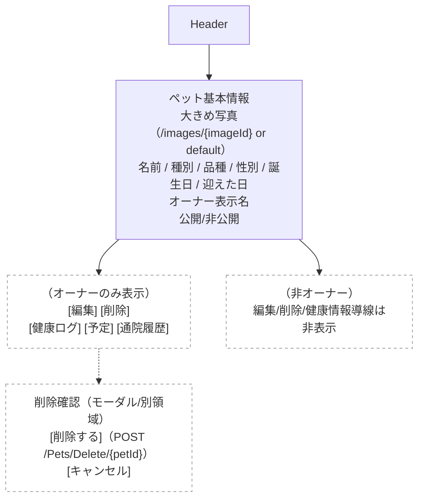
```mermaid
flowchart TB
  Header["Header"]
  Summary["ペット基本情報<br/>大きめ写真（/images/{imageId} or default）<br/>名前 / 種別 / 品種 / 性別 / 誕生日 / 迎えた日<br/>オーナー表示名<br/>公開/非公開"]
  OwnerActions["（オーナーのみ表示）<br/>[編集] [削除]<br/>[健康ログ] [予定] [通院履歴]"]:::note
  NonOwnerNote["（非オーナー）<br/>編集/削除/健康情報導線は非表示"]:::note
  DeleteConfirm["削除確認（モーダル/別領域）<br/>[削除する]（POST /Pets/Delete/{petId}）<br/>[キャンセル]"]:::note

  Header --> Summary
  Summary --> OwnerActions
  Summary --> NonOwnerNote
  OwnerActions -.-> DeleteConfirm

  classDef note fill:#fff,stroke:#999,stroke-dasharray: 4 4,color:#333;
```

- 他ユーザーの **非公開ペットは 404（存在秘匿）**

---

## 12) ペット編集（/Pets/Edit/{petId}）

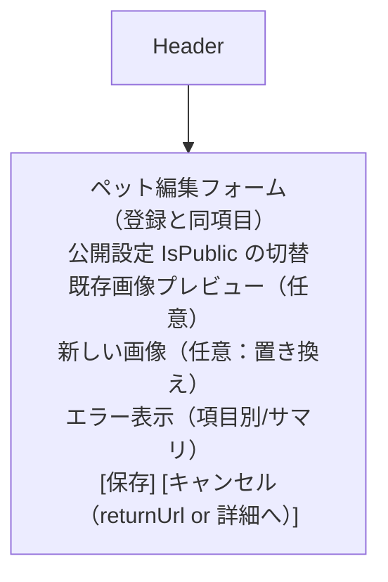
```mermaid
flowchart TB
  Header["Header"]
  Form["ペット編集フォーム<br/>（登録と同項目）<br/>公開設定 IsPublic の切替<br/>既存画像プレビュー（任意）<br/>新しい画像（任意：置き換え）<br/>エラー表示（項目別/サマリ）<br/>[保存] [キャンセル（returnUrl or 詳細へ）]"]

  Header --> Form
```

---

## 13) 健康ログ：一覧（/HealthLogs?petId={petId}&page={page}）

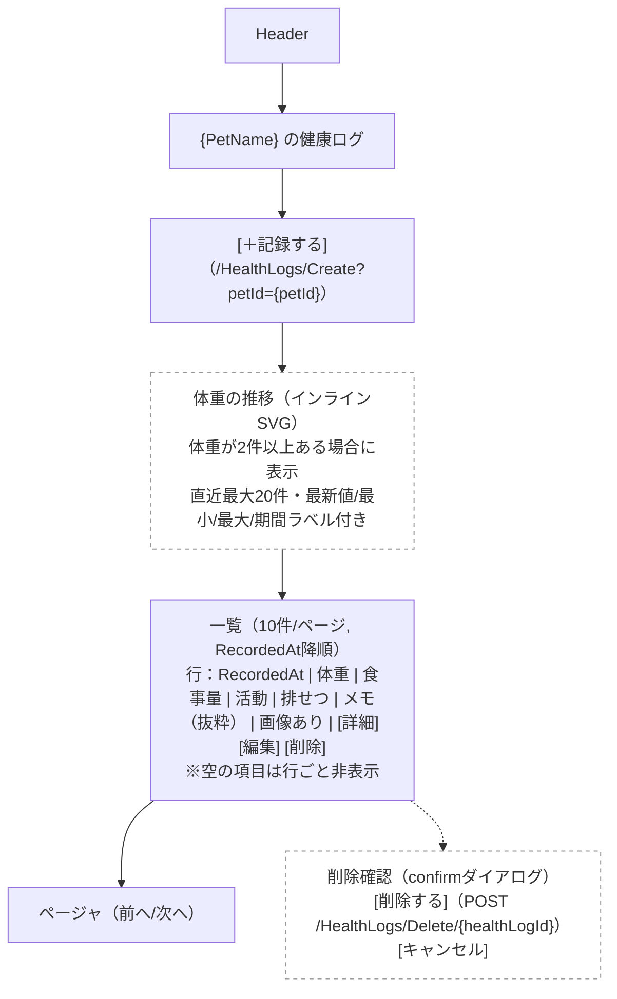
```mermaid
flowchart TB
  Header["Header"]
  Title["{PetName} の健康ログ"]
  Actions["[＋記録する]（/HealthLogs/Create?petId={petId}）"]
  Chart["体重の推移（インラインSVG）<br/>体重が2件以上ある場合に表示<br/>直近最大20件・最新値/最小/最大/期間ラベル付き"]:::note
  List["一覧（10件/ページ, RecordedAt降順）<br/>行：RecordedAt | 体重 | 食事量 | 活動 | 排せつ | メモ（抜粋） | 画像あり | [詳細] [編集] [削除]<br/>※空の項目は行ごと非表示"]
  Pager["ページャ（前へ/次へ）"]
  DeleteConfirm["削除確認（confirmダイアログ）<br/>[削除する]（POST /HealthLogs/Delete/{healthLogId}）<br/>[キャンセル]"]:::note

  Header --> Title --> Actions --> Chart --> List --> Pager
  List -.-> DeleteConfirm

  classDef note fill:#fff,stroke:#999,stroke-dasharray: 4 4,color:#333;
```

- 非オーナーは **404（存在秘匿）**

---

## 13.5) 記録するペットを選ぶ（/HealthLogs/Record）※ボトムナビ「記録」の遷移先

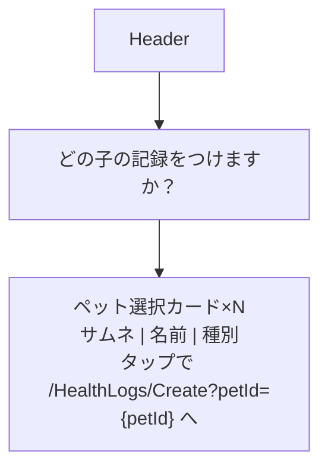
```mermaid
flowchart TB
  Header["Header"]
  Title["どの子の記録をつけますか？"]
  List["ペット選択カード×N<br/>サムネ | 名前 | 種別<br/>タップで /HealthLogs/Create?petId={petId} へ"]

  Header --> Title --> List
```

- ペットが **0匹**：`/Pets/Create?returnUrl=/MyPage` へリダイレクト
- ペットが **1匹**：そのまま `/HealthLogs/Create?petId={petId}` へリダイレクト（選択画面を挟まない）
- ペットが **2匹以上**：この選択画面を表示

---

## 14) 健康ログ：詳細（/HealthLogs/Details/{healthLogId}）

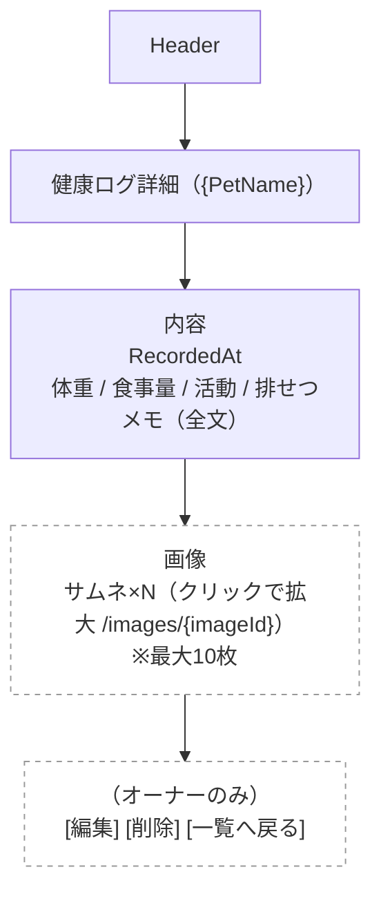
```mermaid
flowchart TB
  Header["Header"]
  Title["健康ログ詳細（{PetName}）"]
  Summary["内容<br/>RecordedAt<br/>体重 / 食事量 / 活動 / 排せつ<br/>メモ（全文）"]
  Images["画像<br/>サムネ×N（クリックで拡大 /images/{imageId}）<br/>※最大10枚"]:::note
  Actions["（オーナーのみ）<br/>[編集] [削除] [一覧へ戻る]"]:::note

  Header --> Title --> Summary --> Images --> Actions

  classDef note fill:#fff,stroke:#999,stroke-dasharray: 4 4,color:#333;
```

---

## 15) 健康ログ：作成（/HealthLogs/Create?petId={petId}）

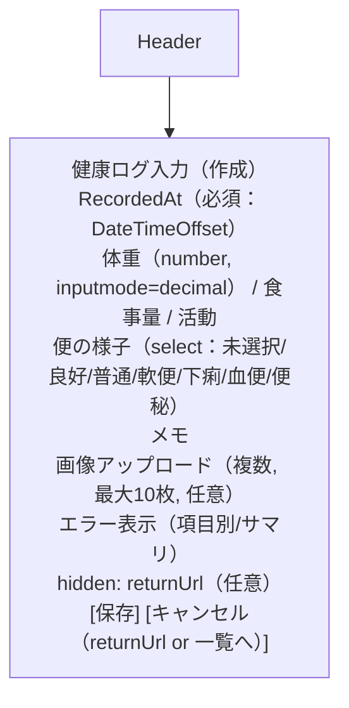
```mermaid
flowchart TB
  Header["Header"]
  Form["健康ログ入力（作成）<br/>RecordedAt（必須：DateTimeOffset）<br/>体重（number, inputmode=decimal） / 食事量 / 活動<br/>便の様子（select：未選択/良好/普通/軟便/下痢/血便/便秘）<br/>メモ<br/>画像アップロード（複数, 最大10枚, 任意）<br/>エラー表示（項目別/サマリ）<br/>hidden: returnUrl（任意）<br/>[保存] [キャンセル（returnUrl or 一覧へ）]"]

  Header --> Form
```

---

## 16) 健康ログ：編集（/HealthLogs/Edit/{healthLogId}）

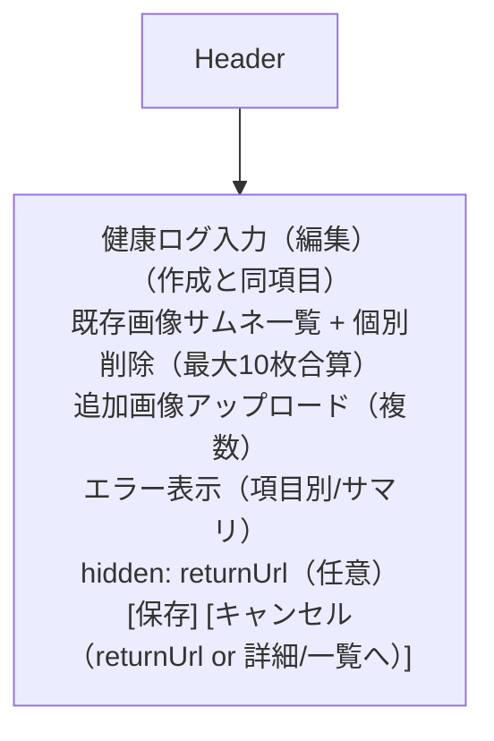
```mermaid
flowchart TB
  Header["Header"]
  Form["健康ログ入力（編集）<br/>（作成と同項目）<br/>既存画像サムネ一覧 + 個別削除（最大10枚合算）<br/>追加画像アップロード（複数）<br/>エラー表示（項目別/サマリ）<br/>hidden: returnUrl（任意）<br/>[保存] [キャンセル（returnUrl or 詳細/一覧へ）]"]

  Header --> Form
```

---

## 17) 予定：一覧（/ScheduleItems?petId={petId}&page={page}）

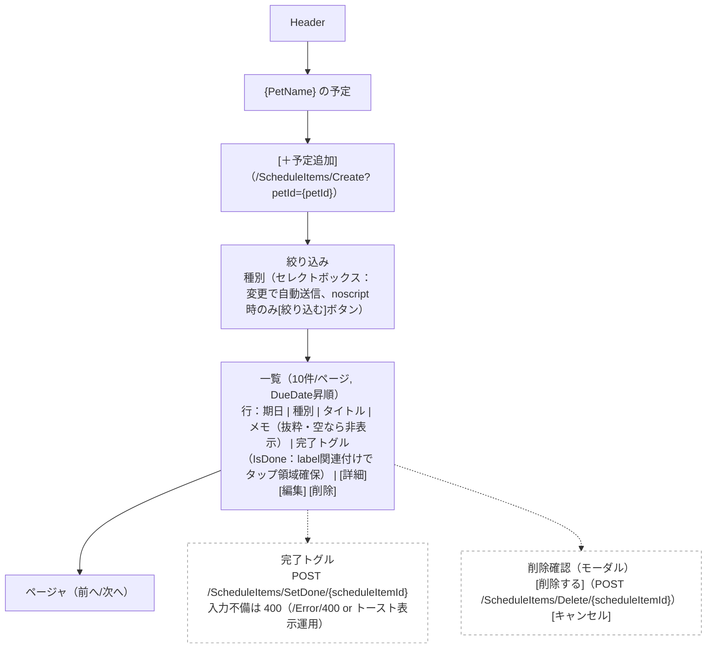
```mermaid
flowchart TB
  Header["Header"]
  Title["{PetName} の予定"]
  Actions["[＋予定追加]（/ScheduleItems/Create?petId={petId}）"]
  Filters["絞り込み<br/>種別（セレクトボックス：変更で自動送信、noscript時のみ[絞り込む]ボタン）"]
  List["一覧（10件/ページ, DueDate昇順）<br/>行：期日 | 種別 | タイトル | メモ（抜粋・空なら非表示） | 完了トグル（IsDone：label関連付けでタップ領域確保） | [詳細] [編集] [削除]"]
  Pager["ページャ（前へ/次へ）"]
  ToggleNote["完了トグル<br/>POST /ScheduleItems/SetDone/{scheduleItemId}<br/>入力不備は 400（/Error/400 or トースト表示運用）"]:::note
  DeleteConfirm["削除確認（モーダル）<br/>[削除する]（POST /ScheduleItems/Delete/{scheduleItemId}）<br/>[キャンセル]"]:::note

  Header --> Title --> Actions --> Filters --> List --> Pager
  List -.-> ToggleNote
  List -.-> DeleteConfirm

  classDef note fill:#fff,stroke:#999,stroke-dasharray: 4 4,color:#333;
```

---

## 18) 予定：詳細（/ScheduleItems/Details/{scheduleItemId}）

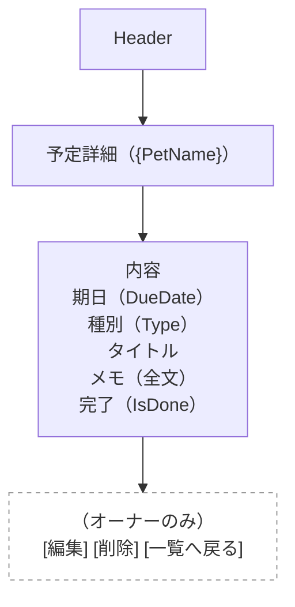
```mermaid
flowchart TB
  Header["Header"]
  Title["予定詳細（{PetName}）"]
  Summary["内容<br/>期日（DueDate）<br/>種別（Type）<br/>タイトル<br/>メモ（全文）<br/>完了（IsDone）"]
  Actions["（オーナーのみ）<br/>[編集] [削除] [一覧へ戻る]"]:::note

  Header --> Title --> Summary --> Actions

  classDef note fill:#fff,stroke:#999,stroke-dasharray: 4 4,color:#333;
```

---

## 19) 予定：作成（/ScheduleItems/Create?petId={petId}）

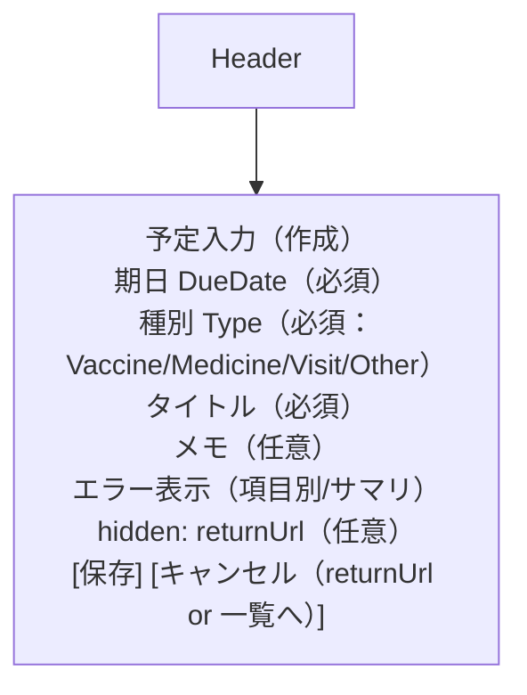
```mermaid
flowchart TB
  Header["Header"]
  Form["予定入力（作成）<br/>期日 DueDate（必須）<br/>種別 Type（必須：Vaccine/Medicine/Visit/Other）<br/>タイトル（必須）<br/>メモ（任意）<br/>エラー表示（項目別/サマリ）<br/>hidden: returnUrl（任意）<br/>[保存] [キャンセル（returnUrl or 一覧へ）]"]

  Header --> Form
```

---

## 20) 予定：編集（/ScheduleItems/Edit/{scheduleItemId}）

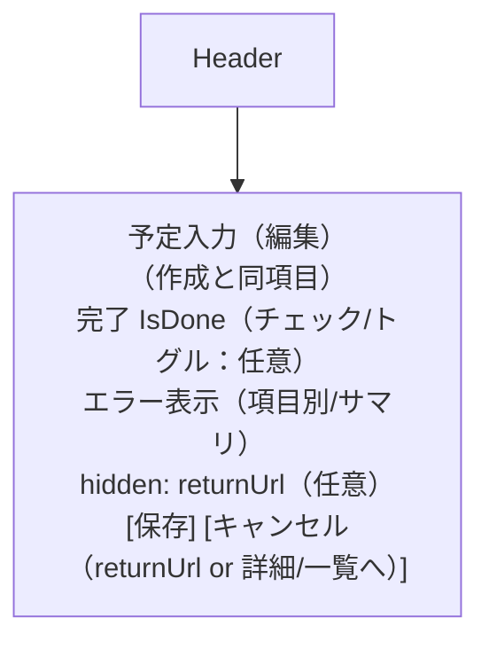
```mermaid
flowchart TB
  Header["Header"]
  Form["予定入力（編集）<br/>（作成と同項目）<br/>完了 IsDone（チェック/トグル：任意）<br/>エラー表示（項目別/サマリ）<br/>hidden: returnUrl（任意）<br/>[保存] [キャンセル（returnUrl or 詳細/一覧へ）]"]

  Header --> Form
```

---

## 21) 通院履歴：一覧（/Visits?petId={petId}&page={page}）

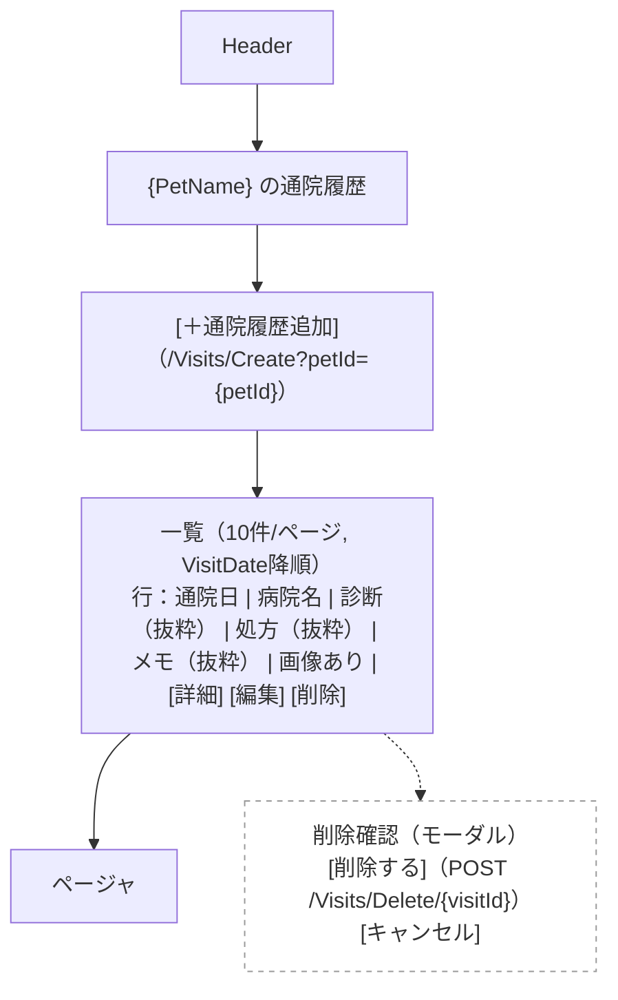
```mermaid
flowchart TB
  Header["Header"]
  Title["{PetName} の通院履歴"]
  Actions["[＋通院履歴追加]（/Visits/Create?petId={petId}）"]
  List["一覧（10件/ページ, VisitDate降順）<br/>行：通院日 | 病院名 | 診断（抜粋） | 処方（抜粋） | メモ（抜粋） | 画像あり | [詳細] [編集] [削除]"]
  Pager["ページャ"]
  DeleteConfirm["削除確認（モーダル）<br/>[削除する]（POST /Visits/Delete/{visitId}）<br/>[キャンセル]"]:::note

  Header --> Title --> Actions --> List --> Pager
  List -.-> DeleteConfirm

  classDef note fill:#fff,stroke:#999,stroke-dasharray: 4 4,color:#333;
```

---

## 22) 通院履歴：詳細（/Visits/Details/{visitId}）

```mermaid
flowchart TB
  Header["Header"]
  Title["通院履歴詳細（{PetName}）"]
  Summary["内容<br/>通院日（VisitDate）<br/>病院名<br/>診断（全文）<br/>処方（全文）<br/>メモ（全文）"]
  Images["画像<br/>サムネ×N（クリックで拡大 /images/{imageId}）<br/>※最大10枚"]:::note
  Actions["（オーナーのみ）<br/>[編集] [削除] [一覧へ戻る]"]:::note

  Header --> Title --> Summary --> Images --> Actions

  classDef note fill:#fff,stroke:#999,stroke-dasharray: 4 4,color:#333;
```

---

## 23) 通院履歴：作成（/Visits/Create?petId={petId}）

```mermaid
flowchart TB
  Header["Header"]
  Form["通院履歴入力（作成）<br/>通院日 VisitDate（必須）<br/>病院名（任意）<br/>診断（任意）<br/>処方（任意）<br/>メモ（任意）<br/>画像アップロード（複数, 最大10枚, 任意）<br/>エラー表示（項目別/サマリ）<br/>hidden: returnUrl（任意）<br/>[保存] [キャンセル（returnUrl or 一覧へ）]"]

  Header --> Form
```

---

## 24) 通院履歴：編集（/Visits/Edit/{visitId}）

```mermaid
flowchart TB
  Header["Header"]
  Form["通院履歴入力（編集）<br/>（作成と同項目）<br/>既存画像サムネ一覧 + 個別削除（最大10枚合算）<br/>追加画像アップロード（複数）<br/>エラー表示（項目別/サマリ）<br/>hidden: returnUrl（任意）<br/>[保存] [キャンセル（returnUrl or 詳細/一覧へ）]"]

  Header --> Form
```

---

## 25) 管理者：ユーザー一覧（/Admin/Users）

```mermaid
flowchart TB
  Header["Top App Bar<br/>うちの子健康カルテ | Admin | Logout"]
  List["ユーザー一覧（Adminのみ）<br/>行：表示名 | Email | [削除]"]
  DeleteConfirm["削除確認（モーダル）<br/>[削除する]（POST /Admin/Users/Delete/{userId}）<br/>[キャンセル]"]:::note
  Danger["注意：削除は関連データ（ペット/健康ログ/予定/通院/画像）を含む物理削除"]:::note

  Header --> List --> Danger
  List -.-> DeleteConfirm

  classDef note fill:#fff,stroke:#999,stroke-dasharray: 4 4,color:#333;
```

- Admin でも「他ユーザーの健康ログ等を閲覧できる」特権は持たず、削除操作のみ
